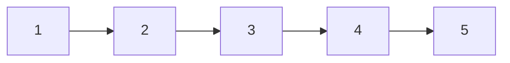
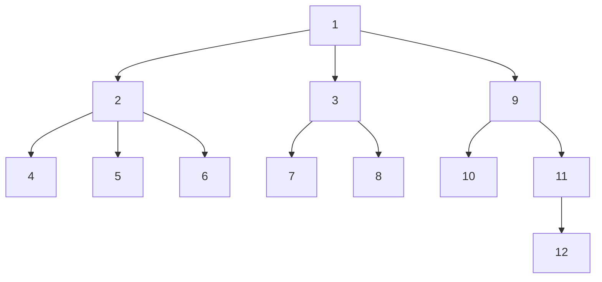
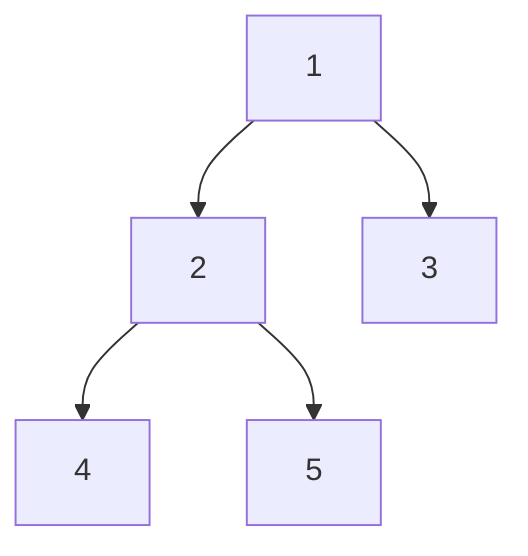
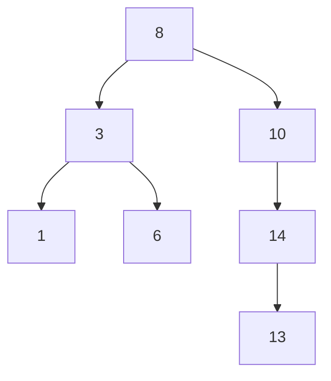
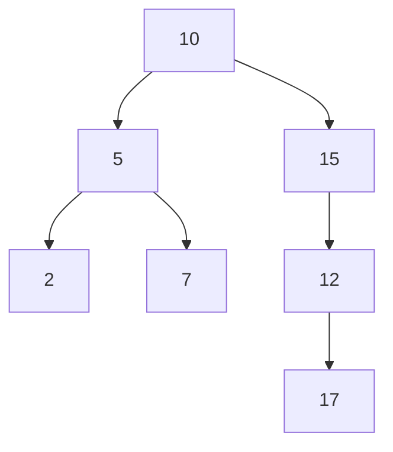

# Árboles

Los árboles son una estructura de datos no lineales, que se compone de nodos, donde cada nodo puede tener cero o más nodos hijos. La estructura de árbol se utiliza en muchas aplicaciones. 

Son una estructura de datos de suma importancia en el mundo de la informática, ya que se utilizan en la implementación de bases de datos, en la creación de compiladores, en la implementación de sistemas operativos, en la creación de algoritmos de búsqueda y ordenamiento, entre otros.

Esto principalmente se debe a que los árboles son una estructura de datos muy eficiente para la organización de datos, ya que permiten realizar búsquedas, inserciones y eliminaciones de elementos de manera eficiente ya que a diferencia de las listas enlazadas, los árboles no son lineales, lo que permite que los datos estén organizados de una manera más eficiente.


Lista enlazada:



Árbol:



## Definición de árbol

Un árbol es una estructura de datos no lineal que se compone de nodos, donde cada nodo puede tener cero o más nodos hijos. La estructura de árbol se utiliza en muchas aplicaciones.

## Implementación de un árbol

Para implementar un árbol, se puede utilizar una clase que represente un nodo, luego este nodo se puede utilizar para crear un árbol a partir de la conexión de nodos.

```cpp
#ifndef TREE_H
#define TREE_H

#include <iostream>

template <typename T>
class Node {
public:
    T data;
    Node* firstChild;
    Node* nextSibling;

    explicit Node(T data);
};

template <typename T>
class Tree {
public:
    Node<T>* root;

    Tree();

    Node<T>* addNode(T data, Node<T>* parent = nullptr);

    void printTree(Node<T>* node, int level = 0);
};

#include "Tree.cpp"

#endif //TREE_H

```

```cpp
#include "Tree.h"


template <typename T>
Node<T>::Node(T data) : data(data), firstChild(nullptr), nextSibling(nullptr) {}

template <typename T>
Tree<T>::Tree() : root(nullptr) {}

template <typename T>
Node<T>* Tree<T>::addNode(T data, Node<T>* parent) {
    Node<T>* newNode = new Node<T>(data);

    if(parent) {
        if(parent->firstChild) {
            Node<T>* sibling = parent->firstChild;
            while(sibling->nextSibling) {
                sibling = sibling->nextSibling;
            }
            sibling->nextSibling = newNode;
        } else {
            parent->firstChild = newNode;
        }
    } else {
        root = newNode;
    }

    return newNode;
}

template <typename T>
void Tree<T>::printTree(Node<T>* node, int level) {
    if(!node) return;

    for(int i = 0; i < level; i++) std::cout << "--";
    std::cout << node->data << '\n';

    printTree(node->firstChild, level + 1);
    printTree(node->nextSibling, level);
}

```

Como pueden ver, la implementación de un árbol es bastante sencilla, se puede implementar un árbol utilizando una clase que represente un nodo, y luego se puede utilizar esta clase para crear un árbol a partir de la conexión de nodos.

## Recorridos de árboles

Los árboles se pueden recorrer de diferentes maneras, los recorridos más comunes son:

- Preorden
- Inorden
- Postorden
- Por niveles
- Por anchura
- Por profundidad

## Árboles binarios

Los árboles binarios son un tipo especial de árbol, donde cada nodo puede tener a lo sumo dos nodos hijos. Los árboles binarios son una estructura de datos muy utilizada en informática, ya que permiten realizar búsquedas, inserciones y eliminaciones de elementos de manera eficiente.



Los arboles binarios tienen la gran ventaja de que su recorrido y lectura poseen una complejidad de O(log n), lo que los hace muy eficientes para la búsqueda de elementos.

## Árboles binarios de búsqueda

Los árboles binarios de búsqueda son un tipo especial de árbol binario, donde cada nodo cumple con la siguiente propiedad:

- El valor del nodo de la izquierda es menor que el valor del nodo actual.
- El valor del nodo de la derecha es mayor que el valor del nodo actual.



Los árboles binarios de búsqueda son una estructura de datos muy utilizada en informática, ya que permiten realizar búsquedas, inserciones y eliminaciones de elementos de manera eficiente.

Estos poseen las funciones de busqueda, inserción y eliminación con una complejidad de O(log n), lo que los hace muy eficientes para la búsqueda de elementos.

### implementación de un árbol binario de búsqueda

```cpp
#ifndef BINARYSEARCHTREE_H
#define BINARYSEARCHTREE_H

#include <iostream>
#include <queue>

template <typename T>
class Node {
public:
    T data;
    Node* left;
    Node* right;

    explicit Node(T data);
};

template <typename T>
class BinarySearchTree {
public:
    Node<T>* root;

    BinarySearchTree();

    void insert(T data);

    Node<T>* search(T data);

    void remove(T data);

    void printTree();

private:
    void insert(Node<T>*& node, T data);

    Node<T>* search(Node<T>* node, T data);

    void remove(Node<T>*& node, T data);

    void printTree(Node<T>* node);
};

#include "BinarySearchTree.cpp"

#endif //BINARYSEARCHTREE_H

```

```cpp
#include "BinarySearchTree.h"

template <typename T>
Node<T>::Node(T data) : data(data), left(nullptr), right(nullptr) {}

template <typename T>
BinarySearchTree<T>::BinarySearchTree() : root(nullptr) {}

template <typename T>
void BinarySearchTree<T>::insert(T data) {
    insert(root, data);
}

template <typename T>
void BinarySearchTree<T>::insert(Node<T>*& node, T data) {
    if(!node) {
        node = new Node<T>(data);
    } else if(data < node->data) {
        insert(node->left, data);
    } else if(data > node->data) {
        insert(node->right, data);
    }
}

template <typename T>
Node<T>* BinarySearchTree<T>::search(T data) {
    return search(root, data);
}

template <typename T>
Node<T>* BinarySearchTree<T>::search(Node<T>* node, T data) {
    if(!node) return nullptr;

    if(data == node->data) {
        return node;
    } else if(data < node->data) {
        return search(node->left, data);
    } else {
        return search(node->right, data);
    }
}

template <typename T>
void BinarySearchTree<T>::remove(T data) {
    remove(root, data);
}

template <typename T>
void BinarySearchTree<T>::remove(Node<T>*& node, T data) {
    if(!node) return;

    if(data < node->data) {
        remove(node->left, data);
    } else if(data > node->data) {
        remove(node->right, data);
    } else {
        if(!node->left && !node->right) {
            delete node;
            node = nullptr;
        } else if(node->left && !node->right) {
            Node<T>* temp = node;
            node = node->left;
            delete temp;
        } else if(!node->left && node->right) {
            Node<T>* temp = node;
            node = node->right;
            delete temp;
        } else {
            Node<T>* temp = node->right;
            while(temp->left) {
                temp = temp->left;
            }
            node->data = temp->data;
            remove(node->right, temp->data);
        }
    }
}

template <typename T>
void BinarySearchTree<T>::printTree() {
    printTree(root);
}

template <typename T>
void BinarySearchTree<T>::printTree(Node<T>* node) {
    if(!node) return;

    std::queue<Node<T>*> q;
    q.push(node);

    while(!q.empty()) {
        Node<T>* current = q.front();
        q.pop();

        std::cout << current->data << ' ';

        if(current->left) q.push(current->left);
        if(current->right) q.push(current->right);
    }
}

```

## Árboles AVL

Los árboles Adelson-Velsky y Landis (AVL) son un tipo especial de árbol binario de búsqueda, llamado árbol de busqueda auto-balanceado, donde la diferencia de altura entre los subárboles izquierdo y derecho de cada nodo es a lo sumo uno.



Los árboles AVL son una estructura de datos muy utilizada en informática, ya que permiten realizar búsquedas, inserciones y eliminaciones de elementos de manera eficiente.

Estos poseen las funciones de busqueda, inserción y eliminación con una complejidad de O(log n), lo que los hace muy eficientes para la búsqueda de elementos.

### Implementación de un árbol AVL

referirse al archivo `AVLTree.h` en este repositorio.
